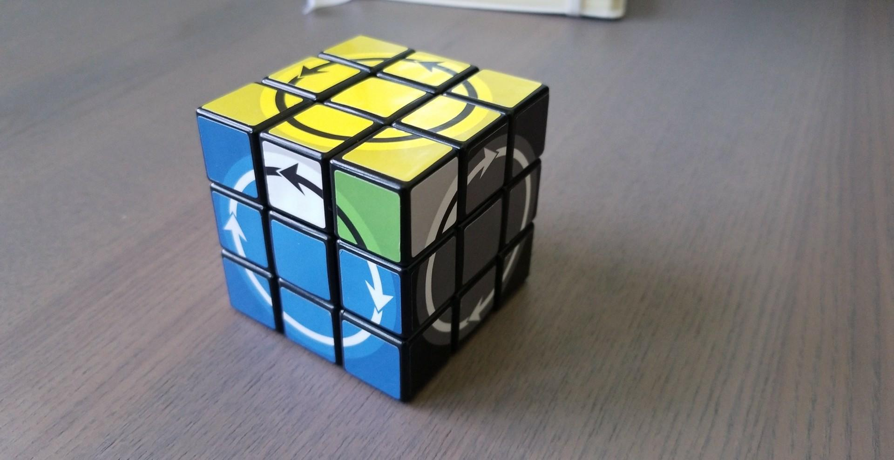

# locky-puzzle

This is my attempt at creating a solver for a twisty puzzle. I don't know what this puzzle is called, and I don't have physical access to it. The [photos](photos) show the puzzle with a [V-perm](https://www.speedsolving.com/wiki/index.php/PLL#V_Permutation) on the yellow layer. A face can turn if all the arrows on that face point in the same rotational direction. In the solved state, opposite faces turn in opposite rotational directions (clockwise and counter-clockwise).



# How it works

Like many [optimal cube solvers](http://www.labri.fr/perso/fleury/courses/pdp/Puzzle_Games/Rubiks_Cube/korfrubik.pdf), my solver uses a form of iterative-deepening-A* (IDA*). IDA* is similar to A*, but it consumes much less memory at the cost of extra CPU cycles. In order to prune the search tree, IDA* uses a lower-bound heuristic on the number of moves it will take to solve a given state.

In my solver, lower-bound heuristics are based on projections of the puzzle state onto a subspace of states. In particular, projections must have the following properties:

 * `Proj(S)` is deterministic for a given state `S`.
 * `Proj(S)` != `Proj(S')` if the locked faces of `S` are not exactly the same as those of `S'`.
 * If `Proj(S1) = Proj(S2)`, then `Proj(M * S1) = Proj(M * S2)`, where `M * S` denotes applying a move `M` to state `S`.

For example, `Proj(S)` could simply retain information about the edges of state `S`, discarding all information about the corners.

Since the set of all `Proj(S)` may be much smaller than the set of all `S`, it is feasible to search the space of all projections (or at least some deep subset of this space). After searching this space, you know that if `Proj(S)` takes N moves to solve, then `S` cannot take fewer than N moves to solve.

In my implementation, there is a [`Proj` trait](src/proj.rs) for projections. It is possible to compose `Proj`s, search the space of `Proj`s, and partially solve a cube so that it is equal to the solved state under a `Proj`. This is all done using type arguments. For example, you can do the following to brute-force the corners of a puzzle:

```rust
proj_solve::<CornerProj, _>(state, NopHeuristic(), max_depth);
```

To speed up the search, you can use generate a heuristic that knows about all <= 7 move corner cases:

```rust
let heuristic = ProjHeuristic::<CornerProj>::generate(7);
proj_solve::<CornerProj, _>(state, &heuristic, max_depth);
```

# Building

Install [Rust](https://rustup.rs), and then run:

```
$ cargo build --release
```

# Results

There are two solvers, both with a different purpose. The optimal solver directly searches for solutions (with a configurable lower-bound heuristic), but takes a long time to solve random scrambles. It is suitable for scrambles up to ~19 moves. The multi-step solver finds sub-optimal solutions, but only takes a few seconds to solve random scrambles.

## Optimal solutions

According to the optimal solver, this is the scramble from the photos:

```
F U2 F' U2 B' U F U' B U' B' U F' U' B
```

You can find a solution to this scramble yourself by running:

```
$ ./target/release/locky-solve --corner-depth 7 --scramble "F U2 F' U2 B' U F U' B U' B' U F' U' B"
Waiting for heuristic...
Trying depth 0...
Trying depth 1...
...
Trying depth 15...
Found solution: B' U F U' B U B' U F' U' B U2 F U2 F'
```

With `--corner-depth 7`, my computer finds the above solution in 4s, and half of this time is spent generating the corner index. With `--corner-depth 6`, it takes 10s.

## Multi-step solutions

To test the multi-step solver, I recommend generating a random scramble:

```
$ ./target/release/locky-scramble --moves 30
F B U' D2 B2 U2 R U2 F2 U2 D2 F' U D' R L' U D' F B2 U' F R' U F' B2 D2 B' U' D'
```

You can then pass the random scramble to the solver like so:

```
$ ./target/release/locky-solve --multi-step --scramble "F B U' D2 B2 U2 R U2 F2 U2 D2 F' U D' R L' U D' F B2 U' F R' U F' B2 D2 B' U' D'"
Generating solver...
Computing solution...
Solution: D B' U F' L D' F R D U D L D' L2 B2 R' B' R L2 U' L2 L' B2 L B' L' B' L B' R' D2 B D2 B' R D2 F' U B U' F' B2 D2 F B2 U B' U' F L' F2 B2 U2 L2 D2 F2 B2 R2 D2 L'
Parts: [  D B' U F' L D' F R D  ] [  U D L D' L2 B2 R' B' R L2 U' L2  ] [  L' B2 L B' L' B' L B' R' D2 B D2 B' R  ] [  D2 F' U B U' F' B2 D2 F B2 U B' U' F  ] [  L' F2 B2 U2 L2 D2 F2 B2 R2 D2 L'  ]
```

Currently, the multi-step solver produces a solution consisting of five steps. For each step, I list the projection(s) under which the puzzle is solved:

 1. Move the arrows into place, unlocking all the faces. (`LockProj`)
 2. Orient all the edges under every color scheme. (`ArrowAxisProj`)
 3. Orient the corners while keeping the edges oriented and unlocked. (`ArrowAxisProj`, `CoFbProj`, `CoRlProj`, `CoUdProj`)
 4. Solve the corners. (`ArrowAxisProj`, `CornerProj`)
 5. Find an optimal solution for the remaining scramble.

The solutions discovered by the multi-step solver are fairly long (the above one is 60 moves!). However, a 60 move solution is better than no solution at all.
